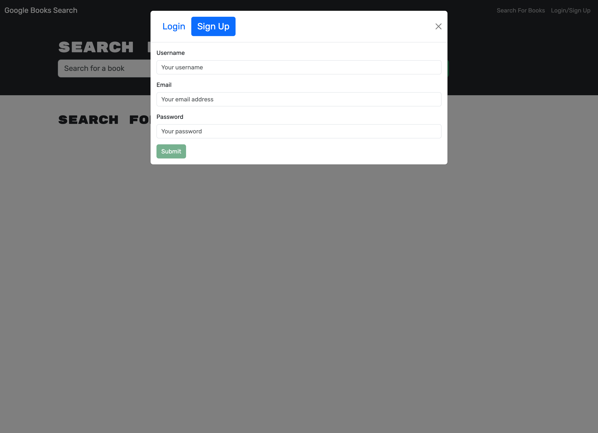

# Google Books Search Engine

## Deployed App

[Google Books Search](https://google-books-search-gx31.onrender.com/)

## Description

Google Books Search is a search engine that uses the Google Books API to provide results to book title searches with an image of the cover, the title and description of the contents of the book. It also allows for user account creation and saving of individual book results to the user's account. Google Books Search was built using React, MongoDB, GraphQL, and Express.

## Table of Contents
- [Requirements](#requirements)
- [Installation](#installation)
- [Usage](#usage)
- [License](#license)
- [Questions](#questions)
- [Screenshots](#screenshots)

## Requirements

Any Web Browser

## Installation

No installation needed.

## Usage

Get started using Google Books Search by visiting the link at the top of the README. Type a book title into the search bar at the top of the page and click the submit button. Results will appear in the body of the page. If you would like to save books for later viewing or keeping record of your own library, you can create an account or login by using the links at the top right hand corner. Once signed in, your search results will contain buttons to save the individual books to your account. To view your saved books, click on `See Your Books` and you will be taken to your books page.

## License

This application is covered under MIT License.

Please refer to the LICENSE file in repo for more information.

## Questions

My GitHub profile: https://github.com/jaredbartos

If you have any further questions, please contact me through email.

jaredbartos@gmail.com

## Screenshots

